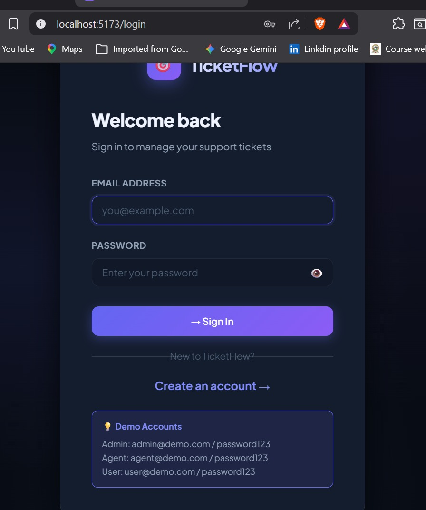
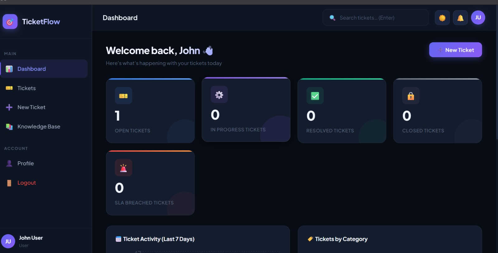
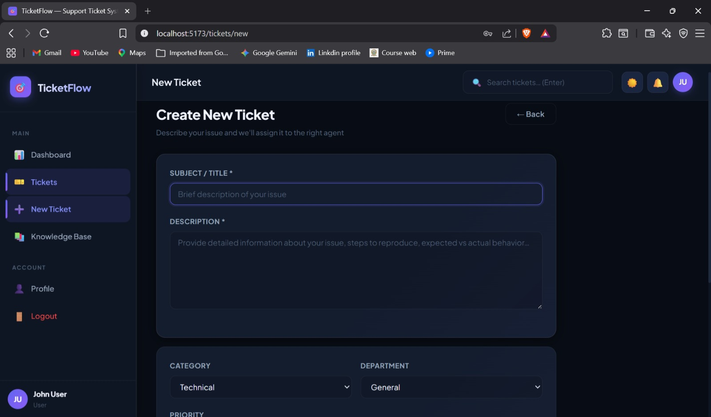
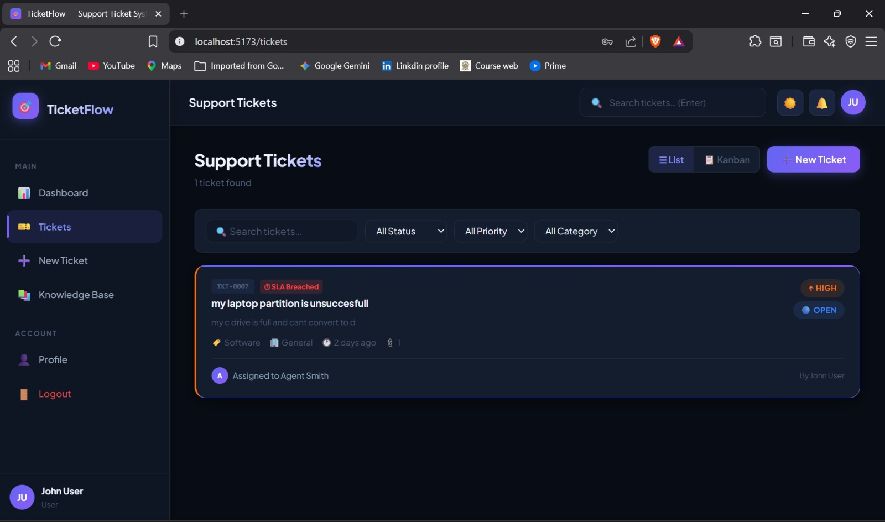
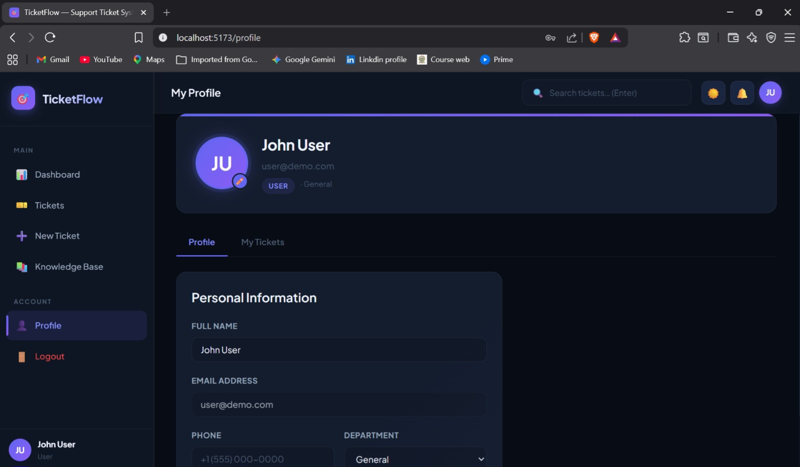

<<<<<<< HEAD
# 🎯 TicketFlow — MERN Support Ticket Management System

A professional, full-stack support ticket management system built with **MongoDB**, **Express.js**, **React**, and **Node.js** featuring real-time updates via Socket.IO.

---

## 🚀 Quick Start

### Prerequisites
- **Node.js** v18+
- **MongoDB** (local or Atlas)
- **npm** v9+

### 1. Server Setup

```bash
cd server
npm install
```

Edit `server/.env` if needed (default config points to `mongodb://localhost:27017/ticketsystem`).

**Seed demo users:**
```bash
node seed.js
```

**Start server:**
```bash
npm run dev          # Development (with nodemon)
# or
npm start            # Production
```

> Server runs on **http://localhost:5000**

### 2. Client Setup

```bash
cd client
npm install
npm run dev
```

> Client runs on **http://localhost:5173**

---

## 🔑 Demo Credentials

| Role  | Email             | Password    |
|-------|-------------------|-------------|
| Admin | admin@demo.com    | password123 |
| Agent | agent@demo.com    | password123 |
| User  | user@demo.com     | password123 |

---

## ✨ Features

### Core
- ✅ JWT Authentication (access + refresh tokens)
- ✅ Role-based access control (User / Agent / Admin)
- ✅ Real-time updates via Socket.IO
- ✅ Responsive dark-mode UI (works on any device)

### Tickets
- ✅ Create, view, filter, search tickets
- ✅ Priority levels with SLA timers (Critical: 2h, High: 8h, Medium: 24h, Low: 72h)
- ✅ File attachments (drag & drop)
- ✅ Status tracking (Open → In Progress → Resolved → Closed)
- ✅ Activity timeline
- ✅ Real-time comments with typing indicators
- ✅ Internal notes (agents/admins only)
- ✅ Kanban view
- ✅ Satisfaction rating system

### Users
- ✅ User registration & login
- ✅ Profile management with avatar upload
- ✅ Auto-assignment of tickets to agents (round-robin by workload)

### Admin
- ✅ User management (role & status changes)
- ✅ Ticket overview table
- ✅ Stats & charts dashboard
- ✅ SLA breach monitoring

### Analytics
- ✅ Daily activity charts
- ✅ Category & priority breakdowns
- ✅ Agent performance tracking
- ✅ CSV export

### Knowledge Base
- ✅ Searchable FAQ articles
- ✅ Category filtering
- ✅ Accordion-style articles

---

## 🏗️ Architecture

```
Miniproject_MERN/
├── client/                    # React + Vite frontend
│   ├── public/
│   │   └── favicon.svg
│   └── src/
│       ├── components/
│       │   ├── dashboard/     # StatsCards, TicketChart, RecentActivity
│       │   ├── layout/        # Layout, Navbar, Sidebar (mobile-friendly)
│       │   ├── notifications/ # NotificationPanel
│       │   ├── tickets/       # TicketCard, TicketForm, TicketTimeline
│       │   └── ui/            # Badge, Loader, Modal
│       ├── context/           # AuthContext, SocketContext
│       ├── hooks/             # useTickets
│       ├── pages/             # All page components
│       ├── services/          # axios API client
│       └── styles/            # index.css (responsive dark theme)
└── server/                    # Express.js backend
    ├── config/                # MongoDB connection
    ├── middleware/             # Auth (JWT), Upload (multer)
    ├── models/                # User, Ticket, Comment, Notification, KnowledgeBase
    ├── routes/                # auth, tickets, users, notifications, kb
    ├── socket/                # Socket.IO event handlers
    ├── seed.js                # Demo data seeder
    └── server.js              # App entry point
```

---

## 📱 Responsive Design

The UI is fully responsive:
- **Desktop (>768px)**: Fixed sidebar, full feature layout
- **Tablet (768–1024px)**: Collapsible charts, stacked grids
- **Mobile (<768px)**: Hamburger menu, slide-in sidebar, mobile search

---

## 🔌 API Endpoints

| Method | Path | Description |
|--------|------|-------------|
| POST | `/api/auth/register` | Register user |
| POST | `/api/auth/login` | Login |
| POST | `/api/auth/refresh` | Refresh access token |
| GET | `/api/auth/me` | Get current user |
| POST | `/api/auth/logout` | Logout |
| GET | `/api/tickets` | List tickets (filtered) |
| POST | `/api/tickets` | Create ticket |
| GET | `/api/tickets/stats` | Dashboard stats |
| GET | `/api/tickets/:id` | Get ticket detail |
| PUT | `/api/tickets/:id` | Update ticket |
| DELETE | `/api/tickets/:id` | Delete ticket (admin) |
| POST | `/api/tickets/:id/comments` | Add comment |
| POST | `/api/tickets/:id/rating` | Rate & close ticket |
| GET | `/api/users` | List users (admin) |
| GET | `/api/users/agents` | List agents |
| PUT | `/api/users/profile` | Update own profile |
| POST | `/api/users/avatar` | Upload avatar |
| GET | `/api/notifications` | Get notifications |
| PUT | `/api/notifications/read-all` | Mark all read |
| PUT | `/api/notifications/:id/read` | Mark one read |
| DELETE | `/api/notifications/:id` | Delete notification |
| GET | `/api/kb` | List KB articles |

---

## 🔧 Environment Variables

```env
PORT=5000
MONGO_URI=mongodb://localhost:27017/ticketsystem
JWT_SECRET=your_jwt_secret_here
JWT_REFRESH_SECRET=your_refresh_secret_here
JWT_EXPIRE=7d
JWT_REFRESH_EXPIRE=30d
NODE_ENV=development
CLIENT_URL=http://localhost:5173
```
=======
# 🎫 TicketFlow

**TicketFlow** is a full-stack, real-time support ticket management system built using the **MERN stack (MongoDB, Express.js, React, Node.js)**. It is designed to streamline IT support workflows by enabling efficient ticket creation, tracking, and resolution with **role-based access control (RBAC)** and **SLA (Service Level Agreement) monitoring**.

---

## 🚀 Features

* 🔐 **Authentication & Authorization**

  * Secure login/signup using JWT
  * Role-based access: User, Agent, Admin

* 🎟️ **Ticket Management**

  * Create, update, assign, and track tickets
  * Status lifecycle: Open → In Progress → Resolved → Closed

* ⚡ **Real-Time Updates**

  * Instant notifications using Socket.IO
  * Live comments and ticket updates without refresh

* ⏱️ **SLA Tracking**

  * Priority-based deadlines (Low, Medium, High, Critical)
  * Visual alerts for SLA breaches

* 🤖 **Automated Agent Assignment**

  * Round-robin / workload-based assignment

* 📊 **Analytics Dashboard**

  * Ticket statistics by category, priority, and status
  * Performance tracking

* 📚 **Knowledge Base**

  * Self-service articles to reduce duplicate tickets

* 📎 **File Attachments**

  * Upload files to tickets and comments

---
## 📸 Screenshots

### 🔐 Login Page



### 🏠 Dashboard



### 🎟️ Ticket Creation & Tracking



### ⚙️ Support Tickets



### 👤 User Profile




## 🏗️ Tech Stack

**Frontend:**

* React.js (Vite)
* Axios
* Socket.IO Client
* Recharts

**Backend:**

* Node.js
* Express.js
* MongoDB (Mongoose)
* Socket.IO
* JWT Authentication

---

## 📂 Project Structure

/client → React frontend
/server → Node.js backend
/models → MongoDB schemas
/routes → API routes
/controllers → Business logic

---

## 🔧 Installation & Setup

```bash
# Clone the repository
git clone https://github.com/your-username/TicketFlow.git

# Install backend dependencies
cd server
npm install

# Install frontend dependencies
cd ../client
npm install

# Run backend
npm run dev

# Run frontend
npm run dev
```

---

## 📌 Use Cases

* IT Service Management (ITSM)
* College/University helpdesk systems
* Customer support platforms
* Internal issue tracking for organizations

---

## 🌍 Future Enhancements

* Email notifications (Nodemailer)
* AI-based ticket classification
* Mobile app (React Native)
* Multi-tenant support
* OAuth integration (Google/Microsoft)

---

## 📎 License

This project is open-source and available for learning and academic purposes.

---

## 👨‍💻 Author

Developed by Srinivasa Vyshnavi
>>>>>>> 9c2a95eaccad03852e9f6085b0cb5cc227164ee8
